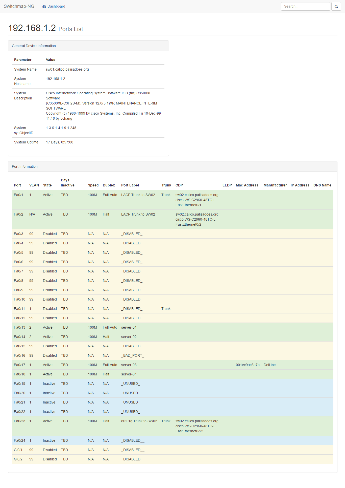

# Introduction

`switchmap-ng` is Python 3 inventory system that reports and tabulates
the status of network connected devices. The information reported
includes:

1.  Open Systems Interconnection model (OSI model) data such as:
2.  Layer 1 information (Network port names, speed, state, neighbors)
3.  Layer 2 information (VLANs, 802.1q trunk links)
4.  Layer 3 information (ARP information)
5.  System status

## Download

You can download the latest code from our [GitHub
Repository](https://github.com/PalisadoesFoundation/switchmap-ng)

## Features

`switchmap-ng` has the following features:

1.  Open source.

2.  Written in python, a modern language.

3.  Easy configuration.

4.  Threaded polling of devices for data. Fast.

5.  Support for Cisco and Juniper gear. More expected to added with
    time.

6.  Support for SNMPv2 and/or SNMPv3 for all configured network devices.

7.  

    The separation of functions into three roles which can be distributed amongst one or more systems.

    :   1.  **Dashboard**: A web server that presents the results
        2.  **Poller**: The system that polls SNMP data. You can have
            multiple pollers located in different geographies posting
            data to a central API server.
        3.  **API Server**: The system that interacts with the Poller,
            Dashboard and a backend MySQL compatible RDBMS database.

We are always looking for more contributors!

## Screenshots

Here are some sample screenshots:

### Dashboard

The dashboard shows a list of devices being polled for data.

### Switch Table

Clicking on any of the links will give interface information.

## Inspiration

The project took inspiration from switchmap whose creator, Pete Siemsen,
has been providing guidance.

## Oversight

`switchmap-ng` is a student collaboration between:

1.  The University of the West Indies Computing Society. (Kingston,
    Jamaica)
2.  The University of Techology, IEEE Student Branch. (Kingston,
    Jamaica)
3.  The Palisadoes Foundation (http://www.palisadoes.org)

And many others.
